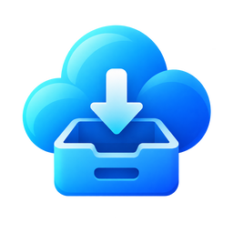

<p align="center">
  
</p>

<h1 align="center">Cloud Storage for Playnite</h1>

<p align="center">
  Turn folders in Google Drive and OneDrive into installable Playnite game libraries.
</p>

<p align="center">
  <a href="https://github.com/GreenFuze/PlayniteCloudSource/releases"></a>
  <a href="LICENSE"></a>
  
</p>

Cloud Storage is a Playnite library plugin for discovering, installing, and
uninstalling games kept in cloud storage. Connect an account, choose one
concrete folder, and its supported game packages appear in Playnite as a normal
library source.

The plugin never writes to or deletes cloud files. Local games, downloads,
staging data, and manifests stay together below one managed storage directory.

## Features

- Google Drive and Microsoft OneDrive with browser-based OAuth login.
- Read-only provider permissions and Windows-user-bound token encryption.
- Recursive discovery below a folder selected with a theme-aware picker.
- ZIP, 7z, and RAR game archives.
- Standalone installers and installer bundles inside archives.
- Common cartridge and arcade ROM formats.
- Download and extraction progress with cancellation and duplicate-install
  protection.
- Safe archive extraction with traversal, link, encryption, and size checks.
- Installer-aware executable selection and editable Playnite play actions.
- Playnite emulator/profile validation before downloading ROMs.
- Managed uninstall that preserves files left behind by native uninstallers.
- Source reconciliation when a cloud package is moved or removed.

## Install

Once the add-on is accepted into Playnite's add-on database, install **Cloud
Storage** from `Main menu > Add-ons > Browse > Libraries`.

For a manual installation, download the latest `.pext` from
[Releases](https://github.com/GreenFuze/PlayniteCloudSource/releases), open it,
and let Playnite restart.

## Configure

1. Open `Main menu > Add-ons > Extension settings > Libraries > Cloud Storage`.
2. Choose the managed root used for local games and temporary staging files.
3. Click **Connect Google Drive** or **Connect OneDrive** and complete the
   provider's sign-in and consent screen.
4. Choose a concrete game-package folder. Drive roots are intentionally not
   selectable, which prevents accidental whole-drive imports.
5. Save settings and update the Cloud Storage library source.

Each provider is optional and can point to a different folder. Disconnecting a
provider removes its local authorization; it does not modify the cloud account.

## Package behavior

| Package | Import and installation behavior |
| --- | --- |
| `.zip`, `.7z`, `.rar` | Downloaded to staging, validated, extracted transactionally, then removed from staging after success. |
| Installer archive | Extracted, then the contained installer runs interactively. Files left by its uninstaller are preserved. |
| Standalone installer bundle | The setup executable and adjacent payload files are downloaded together before setup starts. |
| ROM | Copied byte-for-byte without extraction and attached to a compatible Playnite emulator profile. |

Cloud packages are authoritative only after a successful provider scan. A
missing uninstalled package is removed from the library; an installed game is
retained and marked unavailable so its local installation is not destroyed.

## Security and privacy

- OAuth uses the system browser, PKCE, random state, and an exact loopback
  callback.
- Google Drive requests `drive.readonly`; OneDrive requests delegated
  `Files.Read` and `User.Read`.
- Access and refresh tokens are encrypted with Windows DPAPI for the current
  Windows account and stored in Playnite's extension-data directory.
- Cloud Storage has no telemetry, analytics, advertising, or developer-operated
  backend.
- No user data or OAuth tokens are sent to the plugin author.

See the full [privacy policy](PRIVACY.md).

## Current limitations

- OneDrive currently browses the account's **My files** drive; shared items and
  SharePoint document libraries need explicit drive-identity support.
- Password-protected and multi-volume archives are rejected.
- Multi-file disc sets, ScummVM directories, BIOS/firmware, and shared emulator
  dependencies need separate content strategies.
- Arcade filenames that use MAME machine IDs need a dedicated MAME DAT metadata
  provider; that does not belong in this storage plugin.

## Development

Cloud integrations implement one complete `ICloudSourceProvider` facade for
authentication, folder selection, authoritative scanning, and package streams.
Provider records are translated into neutral `CloudFileEntry` objects, then one
shared discovery and installation pipeline handles the result.

Requirements:

- Windows and .NET Framework 4.6.2 tooling
- Playnite SDK 6.16.0
- A Playnite 10 development build or installation

```powershell
dotnet build .\src\CloudSource.Playnite\CloudSource.Playnite.csproj
dotnet run --project .\tests\CloudSource.Playnite.Tests\CloudSource.Playnite.Tests.csproj
```

Architecture decisions are documented in [`docs/architecture`](docs/architecture).
Bug reports and focused contributions are welcome through GitHub Issues and
pull requests.

## License

Licensed under the [Apache License 2.0](LICENSE).
